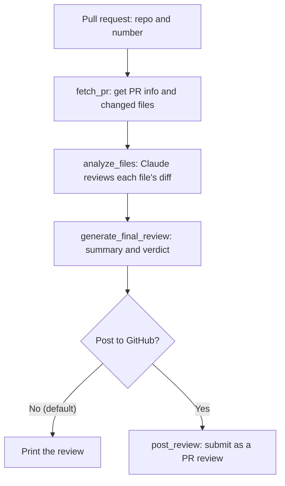

# AI Code Review Agent


An AI agent that reviews GitHub pull requests. It fetches the changed files, has Claude review each one for bugs, security issues, performance problems and code quality, combines the findings into a summary with a verdict (approve, request changes or comment), and can post the review back to the pull request.

[](https://6qerbhls2iponst9xrqkb5.streamlit.app)

## Three ways to run it

| Way | How it works |
|---|---|
| Web app | Open the live app, paste your own Anthropic key and GitHub token in the sidebar, enter `owner/repo` and a PR number, click Run Review. Keys are used for your session only and are never stored |
| Command line | `python main.py owner/repo 42` prints a review (dry run). Add `--post` to post it to the pull request |
| GitHub Actions | A workflow runs the agent automatically when a pull request is opened or updated, and posts the review as a bot |

**What you need:**
- An Anthropic API key. API usage is billed to the account that owns the key, so it needs credit. It is not free.
- A GitHub token. The `public_repo` scope is enough for public repositories, and `repo` is needed for private ones.

## How it works



The four steps are nodes in a LangGraph workflow. They share one state object (repo, PR number, files, per-file reviews, final review, verdict and credentials), and each step adds its results for the next.

LangGraph runs the workflow. LangChain (`langchain-anthropic` and `langchain-core`) supplies the Claude model wrapper (`ChatAnthropic`) and the message types used to send the system prompt and the diff.

1. **Fetch.** PyGithub gets the PR details and the changed files with their diffs. Deleted files and files with no diff are skipped.
2. **Analyze.** Each file's diff goes to Claude with a system prompt that sets a senior-engineer role and asks for JSON: a summary, a list of issues (line, severity, comment) and an overall note. PR descriptions are cut to 500 characters and each diff to 6,000.
3. **Final review.** Claude merges the per-file results into a summary with Critical Issues, Suggestions and a Verdict.
4. **Post.** In post mode, the review and any inline comments are submitted to the pull request. By default nothing is posted.

## Tested on

- A pull request from `fastapi/fastapi`, as a dry run, through the command line and the web app.
- Its own repository's workflow: opening a one-line README edit as a pull request started the GitHub Actions run automatically, and `github-actions[bot]` posted a review (summary, critical issues, suggestions, REQUEST_CHANGES verdict) in under a minute. The agent correctly flagged the throwaway test line as noise.

## Run it locally

Tested on Python 3.11.

```
git clone https://github.com/Marahman02/ai-code-review-agent-.git
cd ai-code-review-agent-
python -m venv venv
venv\Scripts\activate
pip install -r requirements.txt
```

Create a file named `.env` in the project folder with your keys. It is excluded by `.gitignore`, so never commit it:

```
ANTHROPIC_API_KEY=your-key-here
GITHUB_TOKEN=your-token-here
```

Then run either:

```
streamlit run app.py
python main.py owner/repo 42
python main.py owner/repo 42 --post
```

Use `--post` only on repositories where you are allowed to comment. In the web app you can paste the keys in the sidebar instead of using `.env`.

## Automatic reviews with GitHub Actions

The workflow in `.github/workflows/code-review.yml` triggers when a pull request is opened or updated. It installs the dependencies and runs `main.py` with `--post`. To use it in a repository:

1. Copy the workflow file into `.github/workflows/`.
2. Add a repository secret named `ANTHROPIC_API_KEY` (Settings, Secrets and variables, Actions).
3. The workflow uses GitHub's built-in token with `pull-requests: write` permission to post, so no personal token is needed.

Pull requests from forks do not receive repository secrets, so the review does not run on them.

## Files

| File | Purpose |
|---|---|
| `agent.py` | The state, the four workflow nodes, and `run_review()` |
| `github_tools.py` | Everything that talks to GitHub: fetch PR info and files, post a review |
| `prompts.py` | The instructions sent to Claude (persona, per-file prompt, final-summary prompt) |
| `config.py` | Reads the keys from the environment and sets the model (`claude-sonnet-4-6`) |
| `main.py` | Command-line entry point |
| `app.py` | Streamlit web app |
| `.github/workflows/code-review.yml` | Automatic review on pull requests |
| `requirements.txt` | Dependencies |

## Limitations

- It only sees the diff, not the rest of the codebase, so it can miss problems that depend on other files.
- Large diffs are cut at 6,000 characters per file, so very large files are only partly reviewed.
- If Claude's reply cannot be parsed as JSON, that file is reported with a "could not parse" note and no issues, which can look like a clean file.
- The verdict is read from the text of the summary, so it can be wrong.
- Files are reviewed one at a time with no retries, and a failed API call stops the run.
- Pull request content goes into the prompt, so a malicious pull request could try to influence the review.
- Like any model output, reviews can miss real issues or flag things that are fine. A person should make the final call.

## Next steps

- Fix the parse-failure case so it reports an error instead of a clean file
- Give the agent more repository context, not only the diff
- Add retries and measure accuracy on pull requests with known bugs

## Built with

Python, LangGraph, LangChain (`langchain-anthropic`), the Anthropic API, PyGithub, Streamlit and GitHub Actions. The first version was written with Claude Code from a prompt describing the tool, and the GitHub Actions workflow was added the same way. I tested it on real pull requests, deployed it, and debugged the problems that came up along the way.

## Author

Mohammed Abdur Rahman. [GitHub](https://github.com/Marahman02) | [LinkedIn](https://www.linkedin.com/in/abdur-rahmanmohd)
